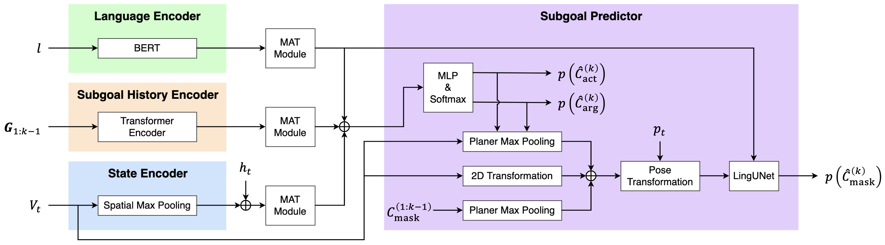

# HLSM-MAT
This is the code repository of HLSM-MAT.



## Setup
1. Clone repo.
```
git clone https://github.com/keio-smilab22/HLSM-MAT.git
cd HLSM-MAT
```

2. Create python environment.
```
conda env create -f hlsm-alfred.yml
conda activate hlsm-alfred
```

3. Clone ALFRED into `alfred_src` in `workspace`.
```
cd workspace/alfred_src
git clone https://github.com/askforalfred/alfred.git
cd ../..
```

4. Define environment variables. **Do this before running every script in this repo.**
```
source init.sh
```

## Preprocessing
Execute the oracle actions on every training environment in ALFRED to collect two types of datasets.
```
python main/collect_universal_rollouts.py alfred/collect_universal_rollouts
```

## Training
Train the high-level controller with MAT.
```
python main/train_supervised.py \
    --def_name alfred/train_subgoal_model \
    --run_name RUN_NAME \
    --mat
```

Train the low-level controller.
```
python main/train_supervised.py \
    --def_name alfred/train_navigation_model
```

Train the semantic segmentation model.
```
python main/train_supervised.py \
    --def_name alfred/train_segmentation_model
```

Train the depth prediction model.
```
python main/train_supervised.py \
    --def_name alfred/train_depth_model
```

## Evaluation
Evaluate on the valid seen fold.
```
python main/rollout_and_evaluate.py \
    --def_name alfred/eval/hlsm_full/eval_hlsm_valid_seen \
    --run_name RUN_NAME
```

Evaluate on the valid unseen fold.
```
python main/rollout_and_evaluate.py \
    --def_name alfred/eval/hlsm_full/eval_hlsm_valid_unseen \
    --run_name RUN_NAME
```

Evaluate on the test seen/unseen folds and collect traces for leaderboard.
```
python main/rollout_and_evaluate.py \
    --def_name alfred/eval/hlsm_full/eval_hlsm_test \
    --run_name RUN_NAME
```
